## 7. Database design

### 7.1 ER diagram

```mermaid
erDiagram
    DEPARTMENTS ||--o{ USERS : "belongs to"
    USERS ||--o{ USER_ROLES : has
    USERS ||--o{ DELEGATIONS : "delegates as"
    USERS ||--o{ PROJECTS : creates

    CATEGORIES ||--o{ PRODUCTS : groups
    CATEGORIES ||--o{ CATEGORIES : "parent of"
    STORAGE_ZONES ||--o{ STORAGE_COMPARTMENTS : contains
    PRODUCTS ||--o{ STOCK_PLACEMENTS : "stored as"
    STORAGE_COMPARTMENTS ||--o{ STOCK_PLACEMENTS : holds
    PRODUCTS ||--o{ STOCK_LEDGER : "history of"
    PRODUCTS ||--o{ ASSET_UNITS : "serialised as"

    USERS ||--o{ BORROW_REQUESTS : requests
    PRODUCTS ||--o{ BORROW_REQUESTS : "for"
    PROJECTS ||--o{ BORROW_REQUESTS : "charged to"
    BORROW_REQUESTS ||--o{ BORROW_RETURNS : "returned via"

    USERS ||--o{ REQUISITIONS : raises
    DEPARTMENTS ||--o{ REQUISITIONS : "from"
    PROJECTS ||--o{ REQUISITIONS : "for"
    REQUISITIONS ||--o{ REQUISITION_ITEMS : contains
    PRODUCTS ||--o{ REQUISITION_ITEMS : "may reference"
    REQUISITIONS ||--o{ REQUISITION_APPROVALS : "gated by"
    USERS ||--o{ REQUISITION_APPROVALS : "assigned to"
    REQUISITIONS ||--o{ REQUISITION_EVENTS : "timeline of"
    REQUISITIONS ||--o{ BOM_REQUISITIONS : "billed on"
    BOMS ||--o{ BOM_REQUISITIONS : "draws from"
    BOMS ||--o{ BOM_LINES : contains
    REQUISITION_ITEMS ||--o| BOM_LINES : "costed as"
    REQUISITIONS ||--o{ FUND_RECEIPTS : funded_by
    REQUISITIONS ||--o{ PURCHASES : "fulfilled by"
    PURCHASES ||--o{ PURCHASE_LINES : contains

    USERS ||--o{ NOTIFICATIONS : receives
    USERS ||--o{ AUDIT_LOG : "acts in"

    USERS {
        uuid id PK
        string employee_code UK
        string full_name
        string designation "prints on BOM"
        string email UK
        string password_hash
        uuid department_id FK
        bool is_active
    }
    USER_ROLES {
        uuid user_id FK
        enum role "GENERAL|APPROVER|INVENTORY_MANAGER|ADMIN"
    }
    DELEGATIONS {
        uuid id PK
        uuid approver_user_id FK
        uuid delegate_user_id FK
        timestamptz starts_at
        timestamptz ends_at
        bool is_active
    }
    PRODUCTS {
        uuid id PK
        string product_code UK "storage id"
        string name
        uuid category_id FK
        string unit "pcs|box|m"
        bool default_returnable "borrow form default"
        bool is_serialised
        bool is_active
    }
    STORAGE_ZONES {
        uuid id PK
        string name "Meta, Nvidia"
    }
    STORAGE_COMPARTMENTS {
        uuid id PK
        uuid zone_id FK
        string code "1A, 3C"
    }
    STOCK_PLACEMENTS {
        uuid id PK
        uuid product_id FK
        uuid compartment_id FK
        int quantity "CHECK >= 0"
        int reserved_qty "CHECK 0<=r<=quantity"
        int version "optimistic lock"
    }
    STOCK_LEDGER {
        bigserial id PK
        uuid product_id FK
        uuid from_compartment_id FK
        uuid to_compartment_id FK
        int quantity
        enum movement_type "RECEIPT|MOVE|ISSUE|RETURN|ADJUST|DISPOSE"
        string ref_type
        uuid ref_id
        uuid performed_by FK
        text note
        timestamptz created_at
    }
    BORROW_REQUESTS {
        uuid id PK
        string borrow_no UK
        uuid requester_id FK
        uuid product_id FK
        uuid placement_id FK
        int quantity
        uuid project_id FK
        bool is_returnable
        date expected_return_date
        text purpose
        enum status "PENDING|REJECTED|ISSUED|PARTIALLY_RETURNED|RETURNED|CANCELLED"
        uuid decided_by FK
        text decision_note
        timestamptz issued_at
        timestamptz returned_at
    }
    BORROW_RETURNS {
        uuid id PK
        uuid borrow_request_id FK
        int quantity
        uuid received_by FK
        text condition_note
        timestamptz returned_at
    }
    REQUISITIONS {
        uuid id PK
        string requisition_no UK
        uuid requester_id FK
        uuid department_id FK
        uuid project_id FK
        enum urgency "LOW|NORMAL|HIGH|CRITICAL"
        date approval_deadline
        text reason
        numeric requested_amount "frozen at submit"
        numeric approved_amount "defaults to requested"
        int required_approver_count "frozen at submit"
        numeric threshold_at_submit
        enum status
        timestamptz submitted_at
    }
    REQUISITION_ITEMS {
        uuid id PK
        uuid requisition_id FK
        uuid product_id FK "null for new items"
        string item_name
        int quantity
        numeric estimated_unit_price
        numeric estimated_line_total
        int in_stock_qty_at_submit
    }
    REQUISITION_APPROVALS {
        uuid id PK
        uuid requisition_id FK
        enum stage "INVENTORY_MANAGER|APPROVER"
        int slot "1 or 2"
        uuid assigned_user_id FK
        uuid acted_by_user_id FK "delegate if any"
        enum action "PENDING|APPROVED|REJECTED|WITHDRAWN"
        text note
        timestamptz acted_at
    }
    REQUISITION_EVENTS {
        bigserial id PK
        uuid requisition_id FK
        string event_type
        uuid actor_id FK
        jsonb payload
        timestamptz created_at
    }
    BOMS {
        uuid id PK
        string bom_no UK
        uuid generated_by FK
        numeric subtotal
        string pdf_url
        bool is_void
        text void_reason
        timestamptz generated_at
    }
    BOM_REQUISITIONS {
        uuid bom_id FK
        uuid requisition_id FK
        jsonb approval_snapshot "names+designations+timestamps"
    }
    BOM_LINES {
        uuid id PK
        uuid bom_id FK
        uuid requisition_item_id FK "source line"
        uuid product_id FK
        string item_name
        int quantity
        numeric unit_cost "IM entered"
        numeric total_cost "generated"
        string vendor
        text purpose
        uuid project_id FK "linked project"
    }
    FUND_RECEIPTS {
        uuid id PK
        uuid requisition_id FK
        numeric amount
        date received_on
        string reference_no
        uuid logged_by FK
        text note
    }
    PURCHASES {
        uuid id PK
        uuid requisition_id FK
        string vendor
        string invoice_no
        date purchased_on
        uuid recorded_by FK
    }
    PURCHASE_LINES {
        uuid id PK
        uuid purchase_id FK
        uuid bom_line_id FK
        uuid product_id FK
        int quantity
        numeric unit_cost
        uuid stocked_to_compartment_id FK
        timestamptz stocked_at
    }
    APP_SETTINGS {
        string key PK
        jsonb value
        uuid updated_by FK
        timestamptz updated_at
    }
```



### 7.2 Key constraints (these are the "error free" part)

```sql
-- one placement row per product per compartment
ALTER TABLE stock_placements
  ADD CONSTRAINT uq_placement UNIQUE (product_id, compartment_id);

-- stock can never go negative, reservations can never exceed stock
ALTER TABLE stock_placements
  ADD CONSTRAINT ck_qty      CHECK (quantity >= 0),
  ADD CONSTRAINT ck_reserved CHECK (reserved_qty >= 0 AND reserved_qty <= quantity);

-- one compartment code per zone
ALTER TABLE storage_compartments
  ADD CONSTRAINT uq_compartment UNIQUE (zone_id, code);

-- an approver appears at most once per requisition
ALTER TABLE requisition_approvals
  ADD CONSTRAINT uq_approval UNIQUE (requisition_id, stage, slot);

-- a BOM may cover several requisitions, but a requisition sits on at most one live BOM
CREATE UNIQUE INDEX uq_live_bom_req
  ON bom_requisitions (requisition_id)
  WHERE bom_id IN (SELECT id FROM boms WHERE is_void = false);
-- enforced belt-and-braces in BomService inside the generating transaction

-- only fully approved requisitions may be added to a BOM  (service-level guard)

-- returns can never exceed what was borrowed  (enforced in service + trigger)
```

`stock_ledger` gets no `UPDATE`/`DELETE` grant at the DB-user level. It is append-only by permission, not by convention.

### 7.3 Concurrency rules

Three users pressing Borrow on the last item at the same instant is the scenario that breaks naive implementations. The rules:

1. **Every stock write happens inside one transaction** that begins with
   `SELECT ... FROM stock_placements WHERE id = $1 FOR UPDATE;`
   Row-level lock, so the second request waits for the first and then re-reads the true quantity.
2. **Optimistic lock on the UI path.** The client sends the `version` it rendered; a mismatch returns `409 Conflict` → "stock changed, refresh". Prevents a stale IM screen from approving against numbers that moved five minutes ago.
3. **Idempotency keys** on all approve/reject/borrow/move endpoints (`Idempotency-Key` header, unique index on the key). Double-click never double-approves.
4. **Approval races**: `UPDATE requisition_approvals SET action='APPROVED' WHERE id=$1 AND action='PENDING'`. Zero rows affected = someone already acted; return a clean error instead of overwriting a rejection.
5. **Nightly invariant check**: `SUM(ledger by product) == SUM(placements by product)`. Mismatch → alert.

### 7.4 Indexes worth having on day one

```
products (name gin_trgm)              -- combobox search
stock_placements (product_id)
stock_ledger (product_id, created_at DESC)
borrow_requests (product_id, created_at DESC), (requester_id), (status)
requisitions (requester_id, created_at DESC), (status)
requisition_approvals (assigned_user_id, action)   -- powers the badge count
requisition_events (requisition_id, created_at)
notifications (user_id, is_read, created_at DESC)
```

---
